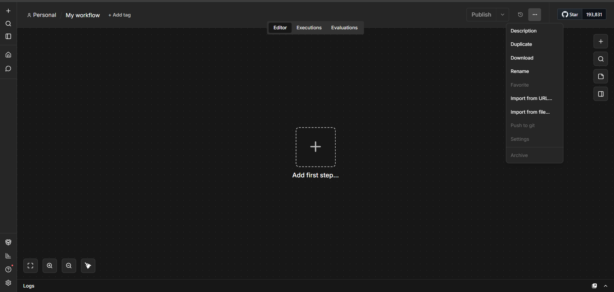

# 🤖 AI Blog Automation (Multilingual) — n8n Workflow

Automatically generate and publish **multilingual, SEO-optimized blog posts** from a Google Sheet to WordPress using **OpenAI gpt-5.5**.

> One click → reads topic → detects language → writes blog → posts to WordPress → updates RankMath SEO → marks Done in sheet.

---

## 📥 Import into n8n

Click the **`···` menu** (top-right in any workflow editor) → **"Import from file..."** → select `AI_Blog_Automation_Multilingual.json`



After import, red warning icons on nodes are **normal** — just fill in your credentials below.

---

## ✅ Prerequisites

| What | Details |
|---|---|
| n8n | Self-hosted or Cloud (v1.0+) |
| OpenAI API Key | `gpt-5.5` access required |
| OpenAI Vector Store ID | Optional but recommended (`vs_...`) for better output |
| Google Sheet | Two columns: `Title` and `Status` |
| Google OAuth2 | Connected in n8n credentials |
| WordPress | REST API + Application Passwords enabled |
| RankMath Plugin | Installed on your WordPress site |
| Featured Image | Already uploaded to your WP Media Library |

---

## ⚙️ Configuration — Fill These In

Open each node and replace every `YOUR_*` placeholder:

| Placeholder | Node | Where to Get It |
|---|---|---|
| `YOUR_OPENAI_API_KEY` | Generate Blog | [platform.openai.com/api-keys](https://platform.openai.com/api-keys) |
| `YOUR_VECTOR_STORE_ID` | Generate Blog | OpenAI Platform → Storage → Vector Stores |
| `YOUR_WP_URL` | Resolve Featured Image, Set SEO Meta | Your site URL e.g. `https://yoursite.com` |
| `YOUR_WP_USERNAME` | Resolve Featured Image, Set SEO Meta | WP Admin → Users |
| `YOUR_WP_APP_PASSWORD` | Resolve Featured Image, Set SEO Meta | WP Admin → Users → Profile → Application Passwords |
| `YOUR_FEATURED_IMAGE_URL` | Resolve Featured Image | WP Admin → Media → copy image File URL |
| `YOUR_WEBSITE_DOMAIN` | Generate Blog (system instructions) | Your domain e.g. `yoursite.com` |
| Post to WordPress credential | Post to WordPress node | Add via n8n Credentials panel |

> **No vector store?** Remove the `tools: [...]` block in the Generate Blog node — it still works without it.

> **WordPress App Password:** WP Admin → Users → Your Profile → scroll to **Application Passwords** → enter any name → click Add → copy the password.

---

## 📊 Google Sheet Format

| A — `Title` | B — `Status` |
|---|---|
| IVF Treatment Benefits | *(leave blank)* |
| PCOS Symptoms in Tamil | *(leave blank)* |
| Male Infertility Causes | Done |

- Leave Status **blank** for topics to process
- Workflow auto-writes `Done` after posting
- To re-run a topic, just **clear its Status cell**
- Rows with `Done`, `Published`, or `Completed` are skipped

---

## 🌐 Language Detection

Add a language suffix to the topic title — the workflow handles the rest:

| Sheet Title | Blog Content Language | Slug |
|---|---|---|
| `IVF Treatment Benefits` | English | `ivf-treatment-benefits` |
| `IVF Treatment in Tamil` | Tamil | `ivf-treatment-in-tamil` |
| `PCOS Symptoms in Hindi` | Hindi | `pcos-symptoms-in-hindi` |
| `Fertility Tips in Kannada` | Kannada | `fertility-tips-in-kannada` |

**Supported:** `in Tamil` · `in Hindi` · `in Kannada` · `in Bengali` · `in English`

The `title`, `meta_title`, `focus_keyword`, `tags`, and `slug` are always in English. Only the blog body, excerpt, and FAQs are in the target language.

---

## 🗺️ How It Works

```
Schedule / Manual Start
    → Read Google Sheet
    → Find first pending topic + detect language
    → Generate blog via OpenAI gpt-5.5 (JSON schema enforced)
    → Parse + validate output → check postReady
    ├── ✅ YES → Resolve image/categories/tags → Post to WP (draft)
    │             → Apply RankMath SEO meta → Mark sheet "Done" → Done ✅
    └── ❌ NO  → Done (Skipped)
```

---

## ▶️ Running the Workflow

**Manually (test):** Click **"Execute workflow"** button — processes one topic per run.

**Scheduled (production):** Toggle **Active** ON — runs daily at **5:30 PM IST** by default.
Change the cron expression in **Schedule Trigger** to adjust timing (e.g., `0 0 */2 * * *` = every 2 hours).

---

## 🐛 Common Issues

| Problem | Fix |
|---|---|
| `No JSON found in output` | Check your OpenAI API key; verify gpt-5.5 access |
| `WordPress 401 error` | Regenerate your WP Application Password |
| `WordPress 403 error` | Enable Application Passwords in WP Settings |
| Category not applied | Category names must **exactly match** WP categories (case-sensitive) |
| Sheet not updating | Verify Document ID and Sheet tab name in both Sheets nodes |
| `postReady: false` | Check `error` field in `Get First Pending` node output |
| `RankMath Error` | Install RankMath SEO plugin on WordPress |
| Blog in English when expecting Tamil | Add `in Tamil` suffix to the topic title in the sheet |

---

## 📁 Files

| File | Description |
|---|---|
| `AI_Blog_Automation_FINAL.json` | English-only · Gemini 2.5 Flash · simpler setup |
| `AI_Blog_Automation_Multilingual.json` | Multilingual · OpenAI gpt-5.5 · File Search (RAG) |
| `image.png` | n8n import screenshot |
| `README.md` | This file |

---

*Built with [n8n](https://n8n.io) · Powered by [OpenAI](https://openai.com) · WordPress-ready*
